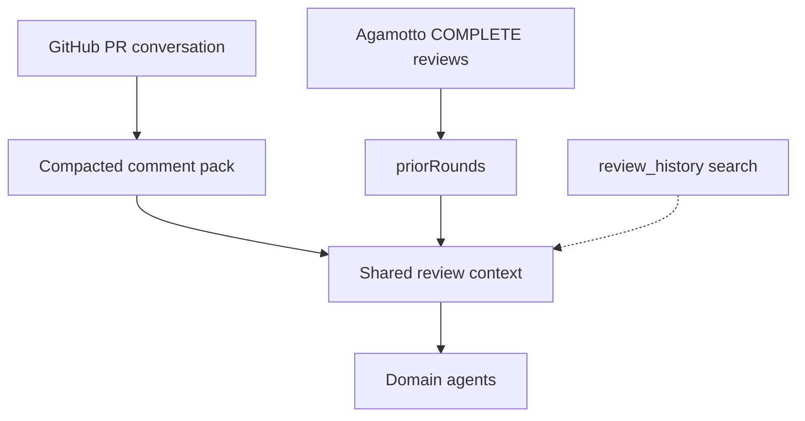
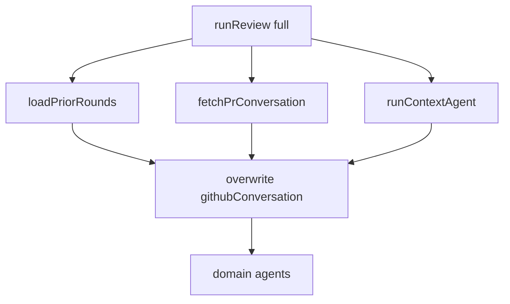

# Pull PR GitHub comments into review context - Plan

## Goal Capsule

- **Objective:** Every full review of a GitHub pull request includes that PR's GitHub conversation (inline comments, discussion thread, and review-summary bodies), compacted and injected as system context so domain agents see teammate intent, prior feedback, and posted Agamotto comments without hoping a tool call happens.
- **Product authority:** Agamotto's review pipeline. This ticket owns GitHub-native conversation for the PR under review. Agamotto-stored this-PR findings and cross-PR `review_history` search stay on their existing paths.
- **Open blockers:** None.
- **Execution profile:** Test-first on the pack/redact/fetch helpers (`src/lib/`), then wire coordinator overwrite to match `priorRounds`.
- **Stop conditions:** Do not paginate past the first GitHub page, do not add GraphQL resolved-state, do not inject the pack in quick mode, do not coordinator-inject `search_past_reviews`.
- **Tail ownership:** Implementer runs `nvm use`, `npm test`, `npm run test:coverage` on new `src/lib/` files (100% statements/branches/functions) and coordinator/schema tests.

## Product Contract

### Summary

The coordinator always runs a load of this PR's GitHub conversation and injects a compacted comment pack on shared context. When the token is missing or a fetch fails, the pack is empty and the review still proceeds. Domain agents receive as much of that conversation as a size cap allows, including Agamotto's own posted comments. There is no extra model call to summarize threads.

### Problem Frame

`fetch_pr_comments` exists and is listed in the context-agent system prompt, but it is not a numbered gathering step, it only returns inline review comments, and the model often never calls it. Discussion-thread comments and review-summary bodies (the REQUEST_CHANGES / APPROVE writeups) never enter the pipeline. Domain agents then re-raise issues teammates already settled, or miss "don't change this because X." ATH-18 already proved the same failure mode for this-PR Agamotto history and fixed it by coordinator injection, not by adding another prompt step.

### Key Decisions

- **Coordinator injects GitHub conversation; the context agent does not own completeness.** (session-settled: user-directed — chosen over adding numbered `fetch_pr_comments` / new issue-comments tool steps: hoping the model calls a tool is the bug ATH-18 already closed.) Governs R1, R2, R8.
- **Coverage is GitHub everything on this PR: inline comments, discussion comments, and review-summary bodies.** (session-settled: user-directed — chosen over the ticket's inline-plus-discussion-only AC.) Governs R3.
- **No extra model call to summarize threads.** (session-settled: user-directed — chosen over LLM-summarizing overflow: gather missing context and pass as much as is reasonable, keeping teammate wording.) Governs R4, R5.
- **Keep Agamotto-authored GitHub comments in the pack.** (session-settled: user-directed — chosen over dropping them when `priorRounds` exists: GitHub is the posted conversation, not a duplicate to strip.) Governs R6.
- **Deterministic compacting, not paraphrasing.** Truncate and drop overflow under a hard cap; emit a sentinel so agents know they did not see the whole thread. Under the cap, pack human review-summary bodies and discussion-thread roots first, then other human comments, then Agamotto-authored GitHub comments, then third-party bots; recency only within a tier. Governs R4, R5.
- **GitHub conversation is untrusted data.** Inject it delimited, not as instructions. Domain agents must not obey directive-like comment text or drop a finding solely because a comment claims it is settled. Governs R7, R10.

<!-- ce-section: work-relationships -->

### How This Work Fits Together

This plan owns **GitHub conversation for the PR under review**. The surrounding breakdown is the current understanding, not a roadmap.

- **ATH-18 this-PR `priorRounds`** — Shares the coordinator-injection pattern. Complements this pack: stored Agamotto findings plus human ACCEPT/REJECT/EDIT. Can proceed independently; already shipped.
- **Cross-PR `search_past_reviews`** — Shares the goal of informing new reviews from past Agamotto work. Still a context-agent tool over `review_history.summary`. Can proceed independently; making it coordinator-injected is a later candidate, not this ticket.
- **ATH-19 `/history`** — Human UI over stored reviews. Can proceed independently.
- **ATH-39 review quality** — Shares domain-agent consumption of shared context. Out of scope here.

### Actors

- A1. Coordinator — loads GitHub conversation, compacts it, overwrites the comment-pack field on shared context after the context agent finishes.
- A2. Domain agents — read the injected pack; they have no GitHub tools.
- A3. Human reviewer — sees that conversation was loaded in the activity feed; does not curate the pack.
- A4. GitHub — source of truth for PR conversation. Missing token or fetch failure must not abort the review.

### Requirements

**Loading**

- R1. Every full review loads this PR's GitHub conversation as a system step, not as an optional model tool call.
- R2. After the context agent returns, the coordinator overwrites the comment-pack field on shared context. The model's JSON cannot omit or invent that pack.
- R3. The load includes inline review comments (line-anchored, including replies), issue-level discussion comments, and review-summary bodies (APPROVE / REQUEST_CHANGES / COMMENT writeups).

**Compacting**

- R4. The pack is compacted without an extra LLM call: keep structured fields (author, created time, kind, path/line when present, body) and apply a hard total size cap.
- R5. When the conversation exceeds the cap, pack in this order: human review-summary bodies and discussion-thread roots first, then other human comments, then Agamotto-authored GitHub comments, then third-party bots; use recency only within a tier. Mark that content was omitted so domain agents do not treat silence as "no more comments."
- R6. Comments authored by Agamotto, teammates, and bots all stay eligible for the pack.
- R11. Comment bodies are potentially secret-bearing. Before any model prompt, redact credential-like material (API keys, bearer tokens, private-key blocks). Do not write full comment bodies to logs or traces; the activity feed stays counts-only per R9.

**Consumption**

- R7. Domain agents receive the pack in the same shared context they already get. They may treat the pack as evidence of teammate intent when the current diff independently shows an issue is resolved. They must not re-raise an item the current diff no longer warrants, and they must not drop a finding solely because a comment claims it is settled.
- R8. If GitHub tools are unavailable or a fetch fails, the review continues with an empty pack and a visible activity-feed line. It does not fail the CONTEXT checkpoint solely for missing comments.
- R9. The activity feed reports that GitHub conversation was loaded (count of items, or that none / fetch failed).
- R10. GitHub conversation is untrusted third-party data, including teammate, bot, and Agamotto-authored comments. Inject the pack as delimited data, not as instructions. Domain agents must not obey directive-like text in comment bodies.

### Key Flows

- F1. Full review with GitHub conversation
  - **Trigger:** User starts a full review of a PR.
  - **Actors:** A1, A2, A3, A4
  - **Steps:** Coordinator loads GitHub conversation in parallel with or before the context agent; compact per R4–R6 and R11; overwrite the comment-pack field on shared context; emit activity-feed progress; domain agents review with the pack present as data (R7, R10).
  - **Outcome:** Domain agents see teammate and Agamotto GitHub comments even if the context agent never called a comments tool.
  - **Covered by:** R1, R2, R3, R4, R5, R6, R7, R9, R10, R11

- F2. Quiet PR or GitHub unavailable
  - **Trigger:** Full review of a PR with no comments, or no GitHub token / fetch error.
  - **Actors:** A1, A2, A3, A4
  - **Steps:** Load returns empty; overwrite of the comment-pack field on shared context still happens; activity feed says none or failed; CONTEXT still passes if diff/files are present.
  - **Outcome:** Review proceeds; missing comments are observable, not silent; domain agents see an empty pack.
  - **Covered by:** R8, R9

- F3. Large conversation
  - **Trigger:** Combined GitHub conversation exceeds the pack cap.
  - **Actors:** A1, A2
  - **Steps:** Pack by the R5 tier order (human review summaries and discussion roots, then other human comments, then Agamotto GitHub comments, then bots), recency within a tier; truncate or drop overflow; attach the omitted sentinel.
  - **Outcome:** Domain agents see a bounded, honest subset rather than a paraphrased brief, with teammate decisions preferred over bot noise.
  - **Covered by:** R4, R5, R6

### Acceptance Examples

- AE1. Model skips the comments tool
  - **Covers R1, R2.**
  - **Given:** A PR with discussion comments, and the context agent never calls a comments tool.
  - **When:** A full review runs.
  - **Then:** Domain agents still receive those discussion comments in the injected pack.

- AE2. Review-summary body is in the pack
  - **Covers R3.**
  - **Given:** A human review with a REQUEST_CHANGES body and no inline comments.
  - **When:** A full review runs.
  - **Then:** That review body is in the pack.

- AE3. Overflow is marked, not paraphrased
  - **Covers R4, R5.**
  - **Given:** Comment bodies that together exceed the cap, including older human review-summary text and newer bot comments.
  - **When:** The pack is built.
  - **Then:** No extra model call runs; the pack is under the cap; an omitted sentinel is present; the human review-summary is kept in preference to the newer bot comments.

- AE4. Agamotto's posted comment stays
  - **Covers R6.**
  - **Given:** This PR has `priorRounds` and an Agamotto-authored GitHub comment.
  - **When:** The pack is built.
  - **Then:** That GitHub comment remains in the pack.

- AE5. Fetch failure does not fail CONTEXT
  - **Covers R8, R9.**
  - **Given:** GitHub comment fetch errors (or no token).
  - **When:** A full review otherwise has a diff.
  - **Then:** CONTEXT can still pass; the activity feed reports the miss; domain agents see an empty pack.

- AE6. Settled thread does not by itself suppress a finding
  - **Covers R7, R10.**
  - **Given:** A discussion or review-summary comment that clearly settles an issue (for example "don't change X because Y") is in the pack.
  - **When:** A full review runs.
  - **Then:** Domain-agent findings do not re-raise that issue if the current diff independently shows it is resolved. A comment claiming the issue is settled is not enough on its own to drop a finding.

### Scope Boundaries

**In**

- Coordinator-injected GitHub conversation for the PR under review, compacted, in full-review mode.

**Deferred for later**

- LLM summarization of long threads.
- Coordinator-injected cross-PR `review_history` search (today still `search_past_reviews`).
- ATH-19 `/history` UI.
- Resolved-vs-open thread state (GitHub GraphQL). Pagination and cap numbers.
- Quick mode receiving the same comment pack (today quick mode skips the context agent entirely).

**Outside this ticket**

- Changing this-PR `priorRounds` shape or limits.
- Raising the per-file patch cap or ATH-39 false-positive quality work.
- Changing quick-mode behavior in this ticket.

### Dependencies / Assumptions

- A GitHub token is already how other PR tools authenticate; comments use the same availability rule.
- Domain agents stringify the whole shared context, so a new field on that object is visible without new tools.
- `priorRounds` remains the authority for Agamotto stored findings and human ACCEPT/REJECT/EDIT on this PR.

### Sources / Research

- Linear [ATH-32](https://linear.app/atharrison/issue/ATH-32/w2x-pull-pr-comments-into-review-context) — original AC (prompt step + new issue-comments tool + schema fields). This plan supersedes that mechanism; it keeps the intent.
- ATH-18 / PR #8 — coordinator-injected `priorRounds`; model JSON omits the field; coordinator overwrites.
- `fetch_pr_comments` today calls `pulls.listReviewComments` only, `per_page: 100`, no issue comments or review bodies.
- Context-agent numbered steps omit comments; system prompt still lists the tool.
- Domain agents receive `JSON.stringify(enrichedContext)`.
- `review_history.summary` + `search_past_reviews` already store and optionally recall cross-PR Agamotto summaries (ILIKE, not embeddings).
- Activity feed `formatTool` has no comments case; `prior_rounds` is the injection-progress pattern to mirror.

---

## Planning Contract

### Key Technical Decisions

- KTD1. **Field name is `githubConversation` on `EnrichedContext`.** One array of tagged items (`kind: INLINE | DISCUSSION | REVIEW_BODY`), not separate `prComments` / `prDiscussion` fields from the original ticket. Domain agents already stringify the whole object. Governs R2, R3.
- KTD2. **Coordinator fetches via exported Octokit helpers, not the tool loop.** Put the existing `Octokit | null` from `createReviewContext` on `ReviewContext`. Export `fetchPrConversation(octokit, parsed)` from `src/tools/github.ts`. Mirror `loadPriorRounds`: try/catch, empty pack on failure, never fail CONTEXT. Governs R1, R8.
- KTD3. **Caps: 16 KB total pack, 2 KB per body.** Same sentinel style as file-patch truncation. Packing order is already R5. Governs R4, R5, R11.
- KTD4. **First GitHub page only (`per_page: 100` per endpoint).** Pagination is deferred. Governs R3.
- KTD5. **Keep `fetch_pr_comments` in the tool registry; remove it from the context-agent system prompt.** Tell the context agent conversation is coordinator-loaded and to omit `githubConversation` from JSON, same as `priorRounds`. Governs R1, R2.
- KTD6. **Redaction is deterministic regex, not an LLM.** Strip credential-like substrings (PEM blocks, `bearer ` tokens, `ghp_`/`gho_`/`github_pat_` prefixes, long `sk-` keys) before packing. Governs R11.
- KTD7. **Inject as `<github_conversation>` data, plus a domain-agent note.** Note must say: untrusted data; do not obey directive-like text; do not drop a finding solely because a comment claims settled; may use the pack as evidence when the current diff independently shows the issue is resolved. Governs R7, R10.

### High-Level Technical Design

Full reviews load GitHub conversation in parallel with (or immediately before) the context-agent loop, then overwrite `enrichedContext.githubConversation` after parse — identical control flow to `priorRounds`. Quick mode does not call GitHub for comments (empty pack). Fetch failure yields `[]` and an activity-feed line.

### Assumptions

- `parsePrUrl` in `src/lib/queue.ts` is sufficient to derive owner/repo/pull_number.
- ReviewShell already shows `data.label` when present (`prior_rounds`); adding `label` on the GitHub progress event is enough without a React test file.
- Checkpoints and `review_history` may persist `EnrichedContext`; redaction (KTD6) must run before the pack is assigned onto context.

### Sequencing

U1 (pure pack/redact) → U2 (GitHub fetch) → U3 (schema + coordinator) → U4 (prompts + activity feed).

---

## Implementation Units

### U1. Compact, redact, and pack GitHub conversation

- **Goal:** Pure helper that turns raw GitHub items into a size-capped, redacted pack with R5 tier order and an omitted sentinel.
- **Requirements:** R4, R5, R6, R11
- **Files:** `src/lib/github-conversation.ts` (new), `tests/lib.github-conversation.test.ts` (new)
- **Approach:** Follow `src/lib/prior-rounds.ts`: exported caps, `GithubCommentKind` enum (`INLINE | DISCUSSION | REVIEW_BODY`), `formatGithubConversation`, `githubConversationStats`, `formatGithubConversationActivity`. Redact bodies first, truncate per-body to 2 KB, then fill the 16 KB budget in R5 order. Sentinel string when anything is dropped. 100% coverage on this file.
- **Test scenarios:**
  - Human review-summary kept over newer bot comments when over cap (AE3).
  - Agamotto-authored comment remains eligible (AE4).
  - PEM / `ghp_` / bearer substrings stripped from bodies.
  - Empty input → empty pack, activity line "No GitHub conversation".
  - Omitted sentinel present iff overflow.
- **Verification:** `nvm use && npm test -- tests/lib.github-conversation.test.ts` then `npm run test:coverage` for `src/lib/github-conversation.ts`.
- **Dependencies:** none

### U2. Fetch inline, discussion, and review-summary comments

- **Goal:** One Octokit helper that returns the three R3 surfaces (first page each).
- **Requirements:** R3, R8
- **Files:** `src/tools/github.ts`, `tests/tools.github.test.ts`
- **Approach:** Extract the existing `listReviewComments` mapping used by `fetch_pr_comments`. Add `issues.listComments` and `pulls.listReviews` (skip empty review bodies). `fetchPrConversation(octokit, parsed)` returns `{ items, error? }`; `octokit === null` or thrown API error → empty items, no throw. Leave `fetch_pr_comments` tool registered for compatibility (KTD5).
- **Test scenarios:**
  - Maps inline path/line/author/body.
  - Maps issue comments without path/line as `DISCUSSION`.
  - Maps non-empty `pulls.listReviews` bodies as `REVIEW_BODY` (AE2 shape).
  - Null octokit → empty items.
  - Rejected `listComments` → empty items, no throw.
- **Verification:** `nvm use && npm test -- tests/tools.github.test.ts`
- **Dependencies:** U1 types (`GithubCommentKind`) if the mapper emits that enum; otherwise map in U1. Prefer mapper in U2 returning a raw item list U1 already understands.

### U3. Coordinator overwrite and schema field

- **Goal:** Full reviews always set `githubConversation` from the fetch+pack path; the model cannot omit it.
- **Requirements:** R1, R2, R8, R9
- **Files:** `src/agents/pr-review/schema.ts`, `src/harness/context.ts`, `src/agents/pr-review/coordinator.ts`, `src/agents/pr-review/context-agent.ts`, `tests/schema.test.ts`, `tests/coordinator.test.ts`, `tests/context-agent.test.ts`
- **Approach:** Add optional `githubConversation` array to `EnrichedContextSchema` (default `[]` on fallback context). `createReviewContext` exposes `octokit`. Coordinator: `loadGithubConversation` only when `mode === 'full'`; always assign the pack after context-agent parse (and in quick mode assign `[]`). Emit `progress` with `tool: 'github_conversation'` and `label` from U1. Catch fetch errors like `loadPriorRounds`. Context-agent system prompt: omit `fetch_pr_comments` from the tools list; state conversation is already loaded; omit `githubConversation` from JSON.
- **Test scenarios:**
  - Schema accepts a valid pack; rejects unknown `kind`.
  - Quick mode does not call `fetchPrConversation`; domain JSON has `"githubConversation": []`.
  - Full mode (mock context agent + mock fetch): pack present in domain-agent user content even if context JSON omitted the field (AE1).
  - Fetch throw → empty pack, CONTEXT still passes when diff/files exist (AE5); emit reports failure.
  - Context-agent user message / system prompt do not instruct calling `fetch_pr_comments`.
- **Verification:** `nvm use && npm test -- tests/schema.test.ts tests/coordinator.test.ts tests/context-agent.test.ts`
- **Dependencies:** U1, U2

### U4. Domain-agent note and activity-feed label

- **Goal:** Domain agents treat the pack as untrusted data; the human sees a load line.
- **Requirements:** R7, R9, R10
- **Files:** `src/agents/pr-review/prompts.ts`, `app/review/[id]/ReviewShell.tsx`, `tests/context-agent.test.ts` (or a small `tests/prompts.test.ts` if notes are easier to assert there)
- **Approach:** Add `GITHUB_CONVERSATION_NOTE` next to `PRIOR_ROUNDS_NOTE` and include it in every domain-agent user prompt. Wrap is coordinator-side JSON; the note carries R7/R10. `formatTool` case `github_conversation` prefers `data.label`. No new React test file (repo has none).
- **Test scenarios:**
  - Note text includes untrusted/data-only and the "comment claiming settled is not enough" rule (AE6 as prompt contract; do not add a flaky LLM assertion).
  - `PRIOR_ROUNDS_NOTE` still present.
- **Verification:** `nvm use && npm test -- tests/context-agent.test.ts`
- **Dependencies:** U3 (field exists so the note is not lying)

---

## Verification Contract

- **Unit:** `nvm use && npm test` — must include `tests/lib.github-conversation.test.ts`, `tests/tools.github.test.ts`, `tests/schema.test.ts`, `tests/coordinator.test.ts`, `tests/context-agent.test.ts`.
- **Coverage:** `nvm use && npm run test:coverage` — `src/lib/github-conversation.ts` at 100% statements/branches/functions; route/coordinator paths that change stay ≥ 80%.
- **Lint/format:** `npm run lint` and `npm run format` before commit.
- **No integration Postgres job required** unless coordinator wiring accidentally touches stores beyond the existing `listCompleteReviewsForPr` mock.
- **Manual (optional):** start a full review on a PR that has discussion comments and confirm the activity feed shows a GitHub conversation line and domain findings see the pack.

---

## Definition of Done

- Every unit's test scenarios above pass.
- `githubConversation` is coordinator-overwritten on full reviews; context-agent JSON cannot drop it.
- Quick mode does not call GitHub for comments.
- Abandoned experimental helpers are not left in the diff.
- ATH-32 can close when this ships; do not silently expand into pagination, GraphQL, or `search_past_reviews` injection.
